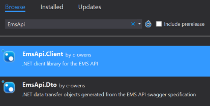

# C\# EMS API Tools and Documentation

# Include the library in your own project (using nuget)
* Start a new project or solution in Visual Studio.
	* *Note:* If you're using .NET framework, the target framework of the project needs to be updated to at least ".NET Framework 4.6.1".
* In the Solution Explorer, right click the References entry under the project and select Manage Nuget Packages...
* Search for "EmsApi", select and install "EmsApi.Client":

# Build from source and try out the examples

## Prerequisites 
* Visual Studio 2015 with Update 3
	* Community edition is supported, but not C# Express, because it does not contain all the necessary portable project types.
* And the EditorConfig extension, to load the project .editorconfig file. This will enforce the code formatting rules:
	* Spaces for indentation (4 spaces per indentation).
	* Lines must end in crlf with no trailing whitespace.
* And the Specflow extension, if you are writing or running tests.

## Build the repository
* Open `EmsApi.sln` and build the whole solution, or run the `build.ps1` file.

## Try out the examples
* Clone the repository.
* Open `Examples\EmsApi.Example.sln`
* Rebuild the solution.
* Right click one of the examples in the Solution Explorer and select "Set as StartUp Project". Use the Debug > Start Debugging menu item to run the example.

## Create a new example project
* Add a new project in the `Examples\EmsApi.Example.sln` solution. Choose your desired flavor of .NET and add the project to the Examples directory.
	* *Note:* If you're using .NET framework, the target framework of the project needs to be updated to at least ".NET Framework 4.6.1".
* In the Solution Explorer, right click the References entry under the project and choose Add Reference...
* Select Browse, select `bin\EmsApi.Client.dll`
	* Make sure the checkbox next to the file is checked in visual studio, and press OK.
* Add nuget references for `Refit 3.0.1` in your project.

## Include the library in your own project (using source)
* Download this repository and build `EmsApi.sln`
* Start a new project or solution in Visual Studio.
* In the Solution Explorer, right click the References entry under the project and choose Add Reference...
* Select Browse, locate `bin` under this directory.
	* Check the checkbox for `EmsApi.Client.dll` and `EmsApi.Dto.dll`
* Add nuget references for `Refit 3.0.1` and `Newtonsoft JSON 9.0.1` in your project.
* The library has a compilation target of .NET standard 1.4, which means it can be used directly from .NET Framework 4.6.1+ and .NET Core 1.1, and some other stuff like UWP and Xamarin.