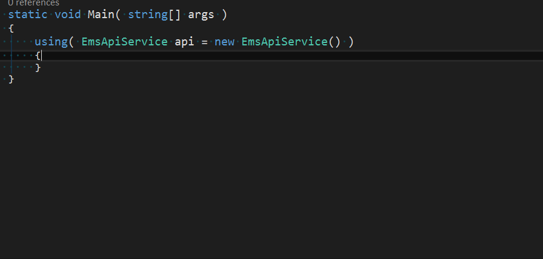

# C\# EMS API Tools and Documentation

[](https://dev.azure.com/ge-flight-analytics/EmsApi.Client/_build/latest?definitionId=1&branchName=master)

# Getting started

## Include the nuget package in your project

### .NET Core or .NET 5
* Create a new library or console project using `dotnet new classlib` or `dotnet new console`.
* Add a referece to the EmsApi package with `dotnet add package EmsApi.Client`.

### .NET Framework
* Start a new project or solution in Visual Studio using `.NET Framework 4.6.1+`.
* In Solution Explorer, right click the References entry under the project and select Manage Nuget Packages...
* Search for "EmsApi", select and install "EmsApi.Client".

## Connect to the api

A username and password must always be specified to connect to the API. They may be retrieved from environment variables as well.

```cs
using System;
using EmsApi.Client.V2;

namespace TestApp
{
class Program
{
	static void Main( string[] args )
	{
		var config = new EmsApiServiceConfiguration()
		{
			// If this is not set, it will be retrieved from the "EmsApiEndpoint" environemnt variable.
			// If neither are set, it will default to EmsApiEndpoints.Default.
			Endpoint = "https://myapiserver/api",
			
			// If this is not set, it will be retrieved from the "EmsApiUsername" environment variable.
			UserName = "my-username",

			// If this is not set, it will be retrieved from the "EmsApiPassword" environment variable.
			// The environment variable must be a base64 encoded UTF-8 string containing the password.
			Password = "p@ssw0rd",

			// Optional application name to use, this is passed to the API server to assist in debugging
			ApplicationName = "MyCoolApp"
		};

		using( EmsApiService api = new EmsApiService( config ) )
		{
			// Your code goes here, call functions on the EmsApiService object...
		}
	}
}
}
```

## Set a cached ems system

Most method calls have an emsSystem argument to indicate which ems system to talk to. This may be omitted by setting the CachedEmsSystem property on the service object.

```cs
// This pattern passes the EMS system to every method call:
using( EmsApiService api = new EmsApiService( config ) )
{
	var fleets = api.Assets.GetAllFleets( emsSystem: 1 );
	var aircraft = api.Assets.GetAllAircraft( emsSystem: 1 );
}

// This pattern sets a cached EMS system to use instead:
using( EmsApiService api = new EmsApiService( config ) )
{
	// Send all requests to the ems system with the id 1.
	api.CachedEmsSystem = 1;
	var fleets = api.Assets.GetAllFleets();
	var aircraft = api.Assets.GetAllAircraft();
}
```

## Access different API functions through properties on the EmsApiService object.

Access to different API routes is exposed through various properties on the EmsApiService class. For instance,
to query the database you would use the `api.Databases` property, and call one of the methods on that object.



## Query the database

The EmsApi.Dto.V2 namespace contains objects that are returned from API calls, as well as a few types that are required to make API calls, including the database query routes.

```cs
using System;
using EmsApi.Client.V2;
using EmsApi.Dto.V2;

namespace TestApp
{
class Program
{
	static void Main( string[] args )
	{
		using( EmsApiService api = new EmsApiService() )
		{
			var query = new DatabaseQuery();

			// Select some fields in the query.
			query.SelectField( Monikers.FlightId );
			query.SelectField( Monikers.TailNumber );
			query.SelectField( Monikers.CityPair );
			query.SelectField( Monikers.TakeoffAirportName );
			query.SelectField( Monikers.LandingAirportName );

			// Filter for takeoff and landing valid.
			query.AddBooleanFilter( Monikers.TakeoffValid, true );
			query.AddBooleanFilter( Monikers.LandingValid, true );

			// Order by flight id.
			query.OrderByField( Monikers.FlightId );

			// Limit to first 100 flights.
			query.Top = 100;

			// Execute the query and receive the result.
			DatabaseQueryResult result = api.Databases.Query( Monikers.FlightDatabase, query, emsSystem: 1 );
			foreach( DatabaseQueryResult.Row row in result.Rows )
			{
				// Go through each result row and print out the information.
				int flightId = Convert.ToInt32( row[Monikers.FlightId] );
				string tail = row[Monikers.TailNumber].ToString();
				string cityPair = row[Monikers.CityPair].ToString();
				string takeoffAirport = row[Monikers.TakeoffAirportName].ToString();
				string landingAirport = row[Monikers.LandingAirportName].ToString();

				string msg = string.Format( "Flight {0} with tail number {1} from {2} to {3} ({4}).",
					flightId, tail, takeoffAirport, landingAirport, cityPair );
				Console.WriteLine( msg );
			}
		}
	}

	private static class Monikers
	{
		public static string FlightDatabase = "[ems-core][entity-type][foqa-flights]";
		public static string FlightId = "[-hub-][field][[[ems-core][entity-type][foqa-flights]][[ems-core][base-field][flight.uid]]]";
		public static string TailNumber = "[-hub-][field][[[ems-core][entity-type][foqa-flights]][[ems-core][base-field][flight.aircraft]]]";
		public static string CityPair = "[-hub-][field][[[ems-core][entity-type][foqa-flights]][[ems-core][base-field][city-pair.pair]]]";
		public static string TakeoffAirportName = "[-hub-][field][[[ems-core][entity-type][foqa-flights]][[[nav][type-link][airport-takeoff * foqa-flights]]][[nav][base-field][nav-airport.name]]]";
		public static string LandingAirportName = "[-hub-][field][[[ems-core][entity-type][foqa-flights]][[[nav][type-link][airport-landing * foqa-flights]]][[nav][base-field][nav-airport.name]]]";
		public static string TakeoffValid = "[-hub-][field][[[ems-core][entity-type][foqa-flights]][[ems-core][base-field][flight.exist-takeoff]]]";
		public static string LandingValid = "[-hub-][field][[[ems-core][entity-type][foqa-flights]][[ems-core][base-field][flight.exist-landing]]]";
	}
}
}
```

## Query time-series flight data

This query works similarly to the database query. You construct a query object, and then add some parameter ids to include, and then execute it for a specific flight.

```cs
using System;
using System.Linq;
using EmsApi.Client.V2;
using EmsApi.Dto.V2;

namespace TestApp
{
class Program
{
	static void Main( string[] args )
	{
		using( EmsApiService api = new EmsApiService() )
		{
			var query = new AnalyticQuery();

			// Include radio altitude id in the time-series query.
			query.SelectAnalytic( RadioAltitudeId );

			// Execute the query.
			QueryResult result = api.Analytics.QueryResults( flightId: 1, query: query, emsSystem: 1 );

			// Access the results.

			double[] offsets = result.Offsets.ToArray();

			// Note: The Results array contains one object per parameter in the query, but we only
			// added one parameter so we take the first one here.
			object[] values = result.Results.First().Values.ToArray();
			for( int i = 0; i < offsets.Length; ++i )
			{
				int offset = Convert.ToInt32( offsets[i] );
				double value = Convert.ToDouble( values[i] );

				Console.WriteLine( "{0}: {1}", offset, value );
			}
		}
	}

	private const string RadioAltitudeId = "H4sIAAAAAAAEAG2QQQuCQBCF74H/Qby7qyUUokJQB8EuidB1WzcdWFfbXbOf35ZYSb3DY2DmY95MdGSq5Tdy5iwtmdBwASbte8OFCiF2aq27EONhGNCwQq2s8NLzfHw6ZDmtWUNcEEoTQZkzMm9CvdoKlUQT2gotCdUTH2BvjbcloEISJ7EWth2NKZhMy2QqFdo3KmsroIRH+GtgBuQdoyYz3Zk9NoQCeOxo2Zs8+P9gIeDam1sTb5TvGtu4gfFnNdqkz94f3FpMzfnvkgfLSh/6UgEAAA==";
}
}
```

## Environment variables

The library supports using environment variables for configuration instead of specifying the configuration in your application.

| Variable Name | Description |
| ------------- | ----------- |
| EmsApiEndpoint | The API url to communicate with. This url must include the /api portion, such as "https://localhost/api". |
| EmsApiUsername | The username to use for authentication with the api. |
| EmsApiPassword | The base64 encoded password for the user. |

# Developing

## Build prerequisites
* .NET 5
* Visual Studio 2019 >= 16.8 (Optional)

## Editor prerequisites
* Text editor or IDE of your choice
* An EditorConfig extension, to enforce code style rules
* The SpecFlow extension for writing unit tests

## Compilation targets
The project is built as a .netstandard2.0 library, which will allow it to work with .NET Framework 4.6.1+ and .NET core 2.0+. Supported frameworks can be found [here](https://github.com/dotnet/standard/blob/master/docs/versions/netstandard2.0.md). The unit test project targets .NET 5.

## Build
Run `dotnet build` in the `src` directory or build with Visual Studio.

## Test
Run `dotnet test` in the `src` directory or use the Visual Studio test explorer. Many tests will talk to a real API endpoint and require the `EmsApiTestEndpoint`, `EmsApiTestUsername`, and `EmsApiTestPassword` environment variables to be set.

## Automated build and test
The project is built using an [Azure DevOps pipeline](https://dev.azure.com/ge-flight-analytics/EmsApi.Client/_build?definitionId=1&_a=summary). Pull requests to the `master` branch are built and the nuget packages are attached to the pipeline run. The `master` branch is also built once the pull request is completed.

## Releases
* Prior to a release, as part of a pull request:
	* The version number should be updated in `src/Build.Directory.props`
	* The [release notes](ReleaseNotes.md) file in the root should be updated
* Once the pull request completes and the [build pipeline](https://dev.azure.com/ge-flight-analytics/EmsApi.Client/_build?definitionId=1&_a=summary) for the `master` branch succeeds, run the [release pipeline](https://dev.azure.com/ge-flight-analytics/EmsApi.Client/_build?definitionId=2). Using the latest master branch build this will:
	* Create a new GitHub release and tag the commit with `vX.X.X`, where the version number matches the contents of the Build.Directory.props file
	* Push the nupkg files to NuGet.org

Note that the latest commit to `master` will be tagged with the release, so a release should not be created unless the latest commit to `master` has succeeded the build pipeline.